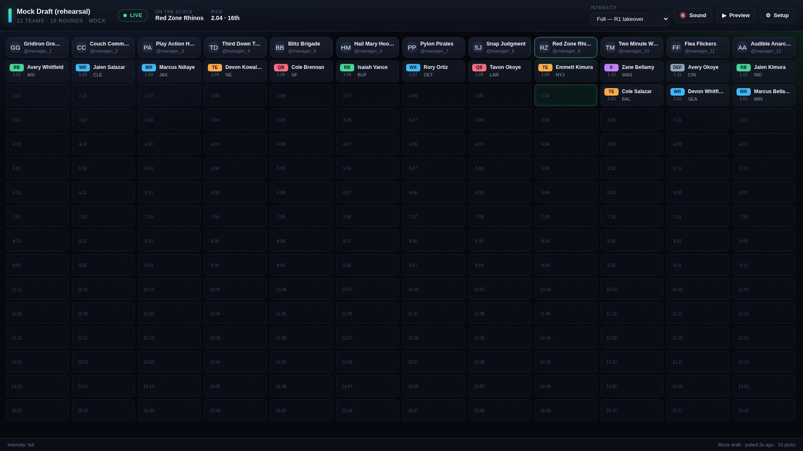
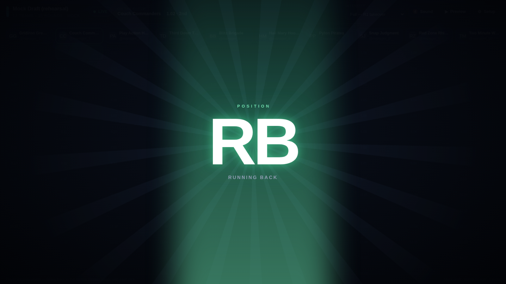
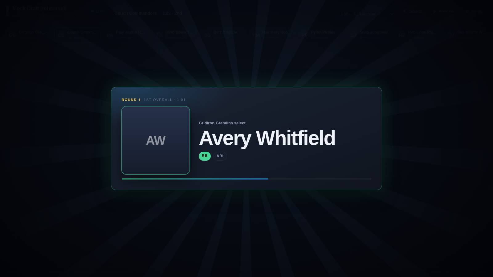

# Draft Room — live Sleeper draft board

A single-page, zero-dependency draft tracker for Sleeper fantasy football leagues.
It polls Sleeper's public API during your draft, fills a snake-order board in real
time, and plays a pack-walkout reveal for every pick — the position flashes first,
then the club, then the player card walks out of the light — with a live intensity
dial you can drop to "subtle" when the draft starts dragging.

Built to look good on a screen recording: dark board, tabular typography, animations
that stay on transform/opacity/filter so they don't stutter while OBS is capturing.



### The walkout

| | |
| --- | --- |
|  |  |
| **1. Position** — a light beam builds, then the position punches in, tinted to that position's colour | **2. Club → 3. Card** — the club badge flashes, then the player card rises out of a burst of light with sparks |

## Run it

```bash
npm start            # serves http://127.0.0.1:8123 (localhost only)
```

No install step, no build, no dependencies — the server is 90 lines of Node stdlib
and the app is plain ES modules. Any static server works; `npm start` just adds the
right security headers.

Then either:

- **Connect a league** — click *Setup*, paste your Sleeper league ID (the digits in
  `sleeper.com/leagues/<league id>/team`), or look it up by Sleeper username.
- **Run a mock draft** — a full 12-team / 15-round rehearsal that emits picks on a
  timer, so you can dial in the animations and sound before draft night.

Optional extras:

```bash
npm run players      # pre-download the player dictionary → data/players.json
npm run audio        # regenerate the placeholder cue audio in audio/
```

## Controls

| Key | Action |
| --- | --- |
| `1` `2` `3` `4` | Intensity: full / compact / subtle / off |
| `S` | Sound on/off |
| `T` | Preview the reveal animation |
| `Esc` | Skip the current reveal (or close Setup) |
| `M` | Mock mode: force the next pick |
| `Space` | Mock mode: pause / resume |

### Intensity tiers

| Mode | Round 1 | Round 2+ |
| --- | --- | --- |
| **Full** | Full walkout: beam → position → club → card, ~5.8s | Same three beats inside a corner banner, ~1.8s |
| **Compact** | Corner-banner walkout | Corner-banner walkout |
| **Subtle** | Board cell highlight + soft blip | Board cell highlight + soft blip |
| **Off** | Board updates silently | Board updates silently |

The beat sheet lives in one object at the top of `js/reveal.js` — every duration
in the sequence is a number you can tune without touching the choreography.

Change it mid-draft from the toolbar or with `1`–`4`. If picks arrive in a burst
(autodraft, or a reconnect after a lull) the director automatically compresses
tiers to catch up rather than queueing a minute of animations.

### Sound

The walkout is scored to its beats, and every beat is a file you can swap:

| Cue | Plays when |
| --- | --- |
| `beam` | the light beam builds |
| `position` | the position card punches in |
| `team` | the club card punches in |
| `reveal` | the player card walks out (round 1 payoff) |
| `sting` | the round 2+ banner resolves |
| `tick` | subtle mode |

**To use your own sound:** drop a file into `audio/` named after the cue —
`reveal.mp3`, `position.wav`, anything your browser can decode — then hit
**Setup → Sound source → Reload**. The panel lists what each cue resolved to,
with a ▶ to audition it. Delete a file and that cue falls back to the built-in
synthesizer, so you can replace one sound or all six. Want different filenames,
or one file turned down? `audio/manifest.json` maps cues to files and gains —
see [`audio/README.md`](audio/README.md).

The files shipped here are placeholders, synthesized by
`scripts/make-placeholder-audio.mjs` (`npm run audio` regenerates them) — so
there is no licensed audio in this repo either way. Prefer the pure-synth
version? **Setup → Sound source → Synth only** ignores the folder entirely.

Browsers block audio until you interact with the page, so click **Sound**
(or press `S`) once before the draft starts.

Team artwork comes from Sleeper's public CDN (`sleepercdn.com`) — player headshots
and NFL club logos. No league shield, no broadcast chime, nothing trademark-adjacent.

## Screen-recording notes

- The board auto-sizes so a 12-team board fits without scrolling on a 1920-wide
  capture; it falls back to horizontal scroll on smaller windows.
- The board auto-scrolls to each new pick, and the on-the-clock column glows.
- Reveals never overlap — one at a time, always.
- If you want a static board with no motion at all, choose **Off**.

Snake and linear drafts are both supported, including Sleeper's third-round
reversal setting. Auction drafts aren't a board format this app models — picks
still appear, but in draft order rather than by nomination.

## What it talks to

| Endpoint | When |
| --- | --- |
| `GET /league/<id>` , `/users` , `/rosters` , `/drafts` | Once, on connect |
| `GET /draft/<id>/picks` | Every 3–10s (default 4s) while the tab is open |
| `GET /draft/<id>` | Every ~8th poll, to notice pause/complete |
| `GET /players/nfl` | At most once a day — cached in IndexedDB |
| `GET /user/<name>` , `/user/<id>/leagues/nfl/<season>` | Only when you use the username lookup |

Draft not started, paused, or finished? It just keeps polling quietly and says so
in the status pill — no errors, no spinner spam. Network blips back off
exponentially (2s → 30s) and recover on their own.

## Security & privacy

This repo is safe to make public — there is nothing in it to leak.

- **No secrets, no env vars, no auth.** Sleeper's v1 read API is public and
  unauthenticated. There is no API key to store and no backend of any kind.
- **No PII in the repo.** Your league ID and preferences live in this browser's
  `localStorage` (namespaced `draftroom:`) and the player cache lives in
  IndexedDB. `Setup → Clear local data` wipes both. `js/config.js` ships blank;
  if you'd rather keep your league ID out of the working tree entirely, just type
  it into the app, or use `js/config.local.js` (gitignored).
- **Locked-down egress.** A strict Content-Security-Policy (meta tag *and*
  response header) allows scripts, styles and audio from this origin only,
  images from `sleepercdn.com`, and network calls to `api.sleeper.app`. Nothing
  else can be loaded or contacted, including by accident — a cue filename in
  `audio/manifest.json` is validated as a plain filename and can only ever
  resolve inside `audio/`.
- **No string-to-DOM anywhere.** Every value from the API is rendered with
  `textContent` or a cloned `<template>` — no `innerHTML`, no `eval`, no
  `new Function`. The test suite fails the build if that changes.
- **Validated inputs.** League, draft, user and player IDs are checked against
  strict allowlist patterns before they are encoded into a URL, so a malformed
  or hostile value can't reshape a request or a CDN image URL.
- **Local-only server.** `serve.js` binds `127.0.0.1`, serves an extension
  allowlist, blocks path traversal, and sends `nosniff`, `no-referrer`,
  `frame-ancestors 'none'` and a restrictive `Permissions-Policy`.
- **No analytics, no telemetry, no cookies, no third-party scripts.**

## Tests

```bash
npm test             # needs playwright: npm i -D playwright
```

Boots the app headless with every external host blocked, runs a mock draft, and
checks the board fills in snake order, the walkout plays its beats in order
(position → club → card, in both the full and banner tiers, asserted on rendered
opacity rather than screenshot timing), the intensity control takes effect,
invalid league IDs are rejected client-side, broken CDN images degrade cleanly,
every placeholder cue decodes and plays (and synth-only mode still produces
signal, neither clipping), and there are no console errors or CSP violations.

## Layout

```
index.html          markup + <template>s (no inline script or style)
css/styles.css      board, reveal cards, stage/toast animations
js/app.js           controller: settings, poll loop, keyboard, wiring
js/sleeper.js       Sleeper API client (validation, timeouts, retry hints)
js/players.js       5MB player dictionary → slimmed + cached for a day
js/board.js         snake board rendering and pick placement
js/reveal.js        tiered reveal director and queue
js/audio.js         cue playback: audio files, with a synth fallback
js/soundpack.js     loads audio/ and resolves each cue to a file
audio/              swappable cue files + manifest.json (placeholders included)
js/mock.js          mock draft source for rehearsals
serve.js            localhost static server with security headers
```
